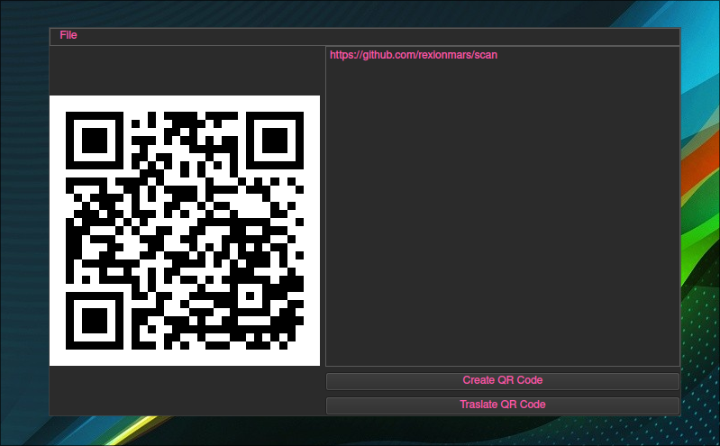

<h1 align="center">S C A N</h1>



## Overview
- [ ] Binnary
- [x] Fast
- [ ] Portable
### Platform suport (in current version)
- [x] Linux
- [X] Windows
- [X] MacOS

## Prerequisites for FrostPKG
- [x] OpenCV
- [x] PyQt5
- [x] QrCode
- [x] Python3

## Getting Started
Manual installation

Clone the repository
```sh
$ git clone https://github.com/rexionmars/scan
```
```sh
$ cd scan
```
```sh
$ pip3 install -r requirements.txt
```

## Usage

```sh
$ python3 main.py
```
